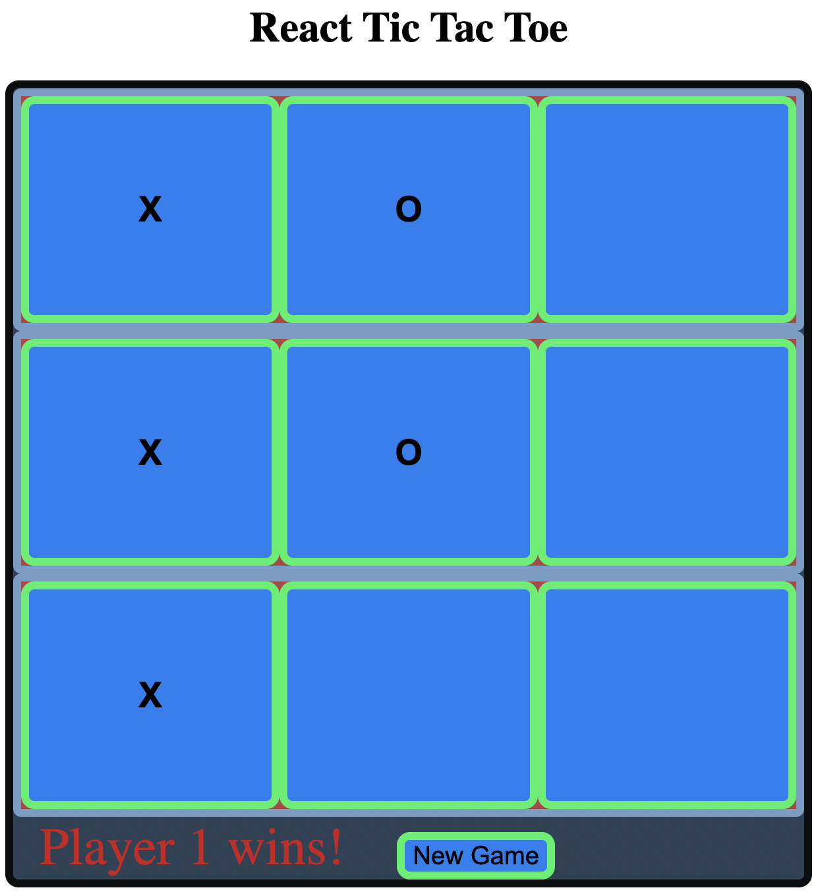

# Tic Tac Toe Game

https://ilyaflaks.github.io/tic-tac-toe

## This is a Tic Tac Toe game created with React

#### How to run: 
- clone this repository / download it to your computer
- the app is running on React CDN so no need to instal node modules!
- if you don't have http-server installed open the command line
- npm install -- global hhtp-server
- cd into the folder with this project 
- http-server -c-1
- navigate to http://localhost:8080/ in your browser
- click on squares to mark them "X" or "O"
- more fun if you play it with a partner

#### This app was created as a part of the MITxPro Professional Certificate in Coding course with specific instructions on how to build it. 
It's also strikingly smililar to the Tic Tac Toe game in the [React Tutorial](https://reactjs.org/tutorial/tutorial.html . No idea why. 
My contributions were: 
- Fixed the bug where one could skip the next player by clicking anywhere on the board
- Fixed the bug which allowed one to click on the same square the second time
- Made all of the squares unclickable after the winner has been determined
- Added a button for a new game which reloads the whole page. Only available after someone wins

### Future Improvements
- Add a "draw" feature with a status message and have the "New Game" button appear when there's a draw

MIT License 
